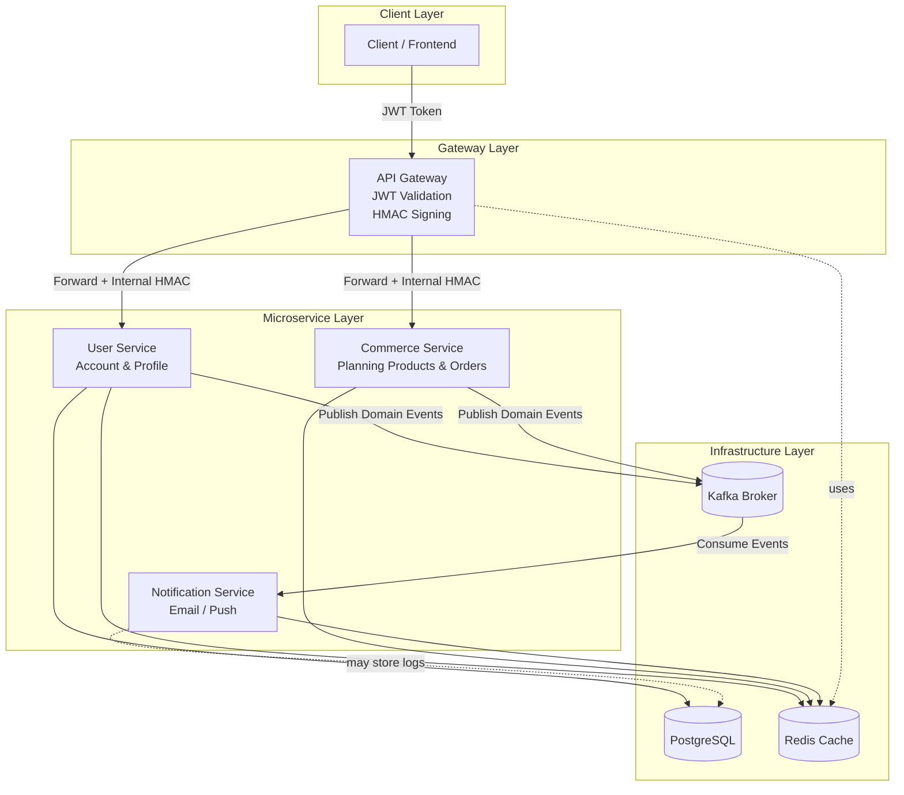
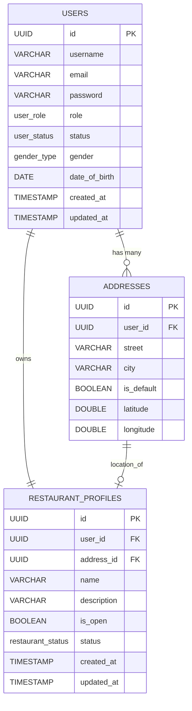

# GogoFood System 
> **GogoFood** là một hệ thống mô phỏng nền tảng đặt món ăn đa dịch vụ,  được xây dựng trên kiến trúc **microservices** với trọng tâm là **bảo mật, mở rộng và tính độc lập giữa các module**.
> Hệ thống được xây dựng bằng Spring Boot 3, PostgreSQL, Redis, Kafka, và Docker Compose nhằm đảm bảo khả năng mở rộng, chịu tải cao và dễ triển khai.
---
## 1. Tổng quan hệ thống 
Hệ thống **GogoFood** được thiết kế theo kiến trúc **microservice**, trong đó mỗi thành phần chịu trách nhiệm cho một domain riêng biệt (User, Commerce, Notification...).

Tất cả request từ Client đều được xử lý thông qua *API Gateway*, đóng vai trò trung gian xác thực và bảo vệ hệ thống: 
  1. Kiểm tra và xác thực **JWT (RSA)**.
  2. Sinh **HMAC nội bộ** để forward sang các service con.
  3. Đảm bảo chỉ có Gateway mới được phép truy cập vào các API nội bộ.
> Các service bên dưới (như User Service hoặc Commerce Service) sẽ tự xác minh tính hợp lệ của HMAC trước khi xử lý logic .

## 2. Thiết kế cơ sở dữ liệu 
Cơ sở dữ liệu của GogoFood được xây dựng trên nền tảng PostgreSQL, đóng vai trò là tầng lưu trữ trung tâm cho các service trong hệ thống. 
Thiết kế hướng tới tính toàn vẹn dữ liệu, ràng buộc nghiệp vụ tại cấp DB, và khả năng mở rộng linh hoạt cho nhiều domain khác nhau (User, Restaurant, Address...). 
### 2.1. Mô hình tổng quan (ERD) 
> Sơ đồ dưới đây thể hiện mối quan hệ giữa các bảng chính trong hệ thống người dùng và nhà hàng:

